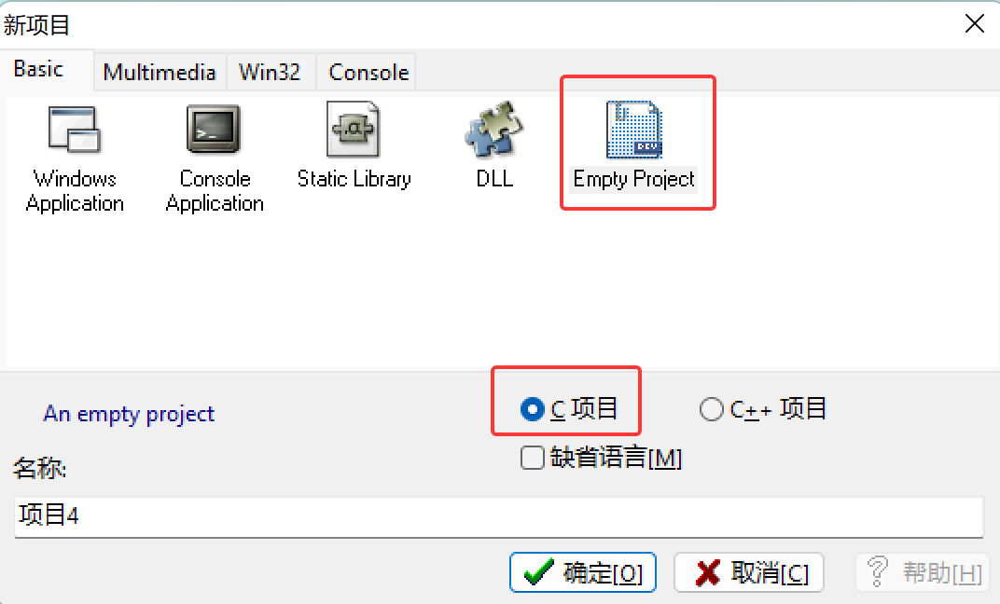
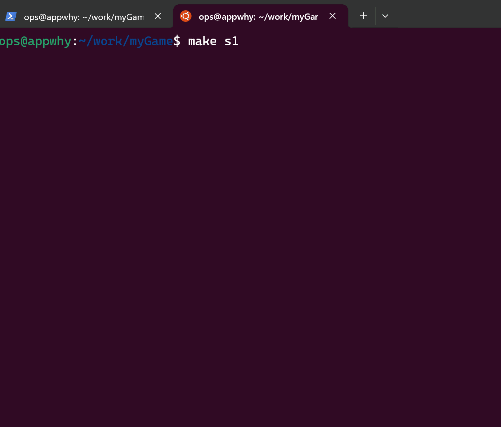

<!-- vscode-markdown-toc -->
* 1. [俄罗斯方块(Tetris)](#Tetris)
	* 1.1. [v1版本](#v1)
	* 1.2. [v2版本](#v2)
* 2. [2048](#)
* 3. [贪吃蛇(Snake)](#Snake)
* 4. [扫雷(MineSweeper)](#MineSweeper)

<!-- vscode-markdown-toc-config
	numbering=true
	autoSave=true
	/vscode-markdown-toc-config -->
<!-- /vscode-markdown-toc -->

# myGame
一些小游戏的C语言实现。

以下游戏均在linux环境下运行， 但也支持windows（我使用的DEV-C++）。为了兼容二者，在`lib/*`文件中使用宏进行了不同平台下的定义。

但在windows下存在以下问题：
1. 不支持ncurses，即tetris.v1不能在windows上编译成功
1. 部分字符（unicode特殊字符）可能乱码

代码组织: 游戏代码本身（v1.cpp或v2.cpp）加上`lib/utils.cpp`才是完整的代码。

dev-c++编译运行代码：创建一个新的空项目，然后按照如下结构将代码文件导入进来，就能编译运行了。

##  1. 俄罗斯方块(Tetris)

###  1.1. v1版本
来源: 在 https://github.com/taylorconor/tinytetris.git 基础上修改得来

注意: 编译代码之前，需要确保你的linux上有`ncurses`的相关头文件。没有的话，需要安装，我在Ubuntu时安装的命令是`sudo apt install libncurses-dev`。

改进:
* 可读性更强, 修改了一些变量名和变量值
* 添加了下一个方块的显示
* 添加了游戏界面的相对(0,0)的偏移

操作:
* 使用左右方向键和ad进行方块的左右移动
* 使用上方向键或w进行方块的顺时针旋转
* 使用下方向键或s让方块直接到底
* q退出

###  1.2. v2版本
来源: 在v1的基础上修改得来

改进:
* 删除了curses.h，使用了printf(ANSI转义序列)代替curses的函数

操作:
* 使用左右方向键和ad进行方块的左右移动
* 使用上方向键或w进行方块的顺时针旋转
* 使用下方向键或s加速方块下落
* 使用Enter键让方块直接到底
* q或`Ctrl+C`退出
* 空格暂停

##  2. 2048

参考: https://github.com/mevdschee/2048.c.git  在此基础上，简化了代码(合并或删除了一些函数)

特性:
* 新产生的数字只有2或4
* 使用方向键、`asdw`、`hjkl`进行上下左右滑动
* q或`Ctrl+C`退出
* 新产生的数字会表示为`%d*`, 以示区别

##  3. 贪吃蛇(Snake)

参考: https://github.com/jvns/snake.git ，删除了ncurses.h, 使用ANSI转义序列代替。

操作:
* 使用方向键、`asdw`、`hjkl`进行上下左右移动
* 当按键方向与移动方向相同时，加速前进
* q或`Ctrl+C`退出
* 空格暂停

##  4. 扫雷(MineSweeper)

操作:
* 使用方向键、`asdw`、`hjkl`进行上下左右移动。
* q或`Ctrl+C`退出
* 空格键或Enter键: 打开光标所在的格子。
* m: mark，标记光标所在的格子，和扫雷的标记插旗子一样。再次按`m`取消标记。
* b: bomb，主动引爆地雷，如果该格子不是地雷，游戏结束。

